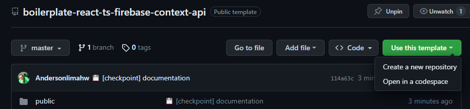
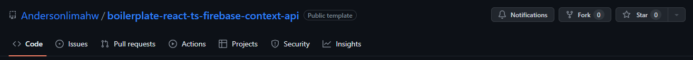
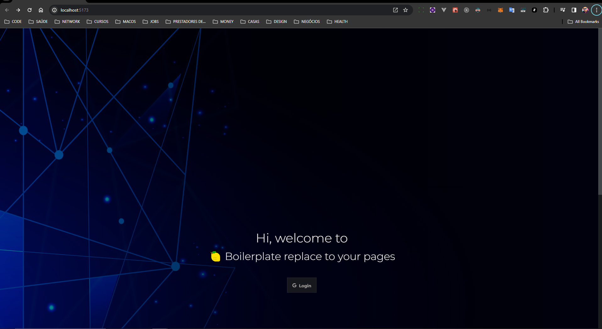

<h1 align="center">Welcome to react boilerplate 👋</h1>
<p>
  

  <a href="#" target="_blank">
    
  </a>

  <a href="https://twitter.com/anderson.lima.dev" target="_blank">
    
  </a>

  <br />
  
 
 
 
 
 
 


> Boilerplate : PWA project using vite, react, context Api, jest and firebase


### ✨ [Demo](https://lemon-todo-list.vercel.app/)

Look a project using this boilerplate

## Using

Use has template




Or fork:



Customize pages how you need!

## ✨ Features ✨:

* Created using vite a very fast front-end tooling
  
* Firebase integration

* Login with google login

* Notification listeners

* Toasts with  react-tostify

* zustand for state management

* JEST for unit tests and code coverage collect


## Boilerplates
Boilerplates are pre-made templates or frameworks that contain a foundational structure, configurations, and often basic functionalities for a particular type of project. They're designed to help kick-start development by providing a starting point, allowing developers to avoid repetitive setup tasks and focus on building specific features.

## Install

```sh
npm install
```

## Config
Change firebase config to your credentials: 

[firebaseConfig documentation](https://firebase.google.com/docs/reference/js/database.md#database_package)

```javascript
  // ./src/services/firebase/firebaseConfig.ts
  const firebaseConfig = {
    apiKey: "",
    authDomain: "",
    projectId: "",
    storageBucket: "",
    messagingSenderId: "",
    appId: ""
  };

```

Allow origin in your firebase console
[firebase console](https://firebase.google.com/docs/hosting/custom-domain?hl=pt)


## Run

```sh
npm run dev

```

Open link in your favorite your browser:
[http://localhost:5173](http://localhost:5173/)



## Run tests

```sh
npm run test
```

## Technologies and strategies:
[vite](https://vitejs.dev/)
[pwa](https://developer.mozilla.org/en-US/docs/Web/Progressive_web_apps)
[react](https://react.dev/learn)
[zustand](https://github.com/pmndrs/zustand)
[typescript](https://www.typescriptlang.org/docs/)
[firebase](https://firebase.google.com/docs)
[jest](https://jestjs.io/docs/getting-started)
[tailwindcss](https://tailwindcss.com/docs/animation)


## Author

👤 **Anderson Lima**

- Website: https://lemondev.framer.ai
- Twitter: [@andersonlimahw](https://twitter.com/andersonlimahw)
- Github: [@andersonlimahw](https://github.com/andersonlimahw)
- LinkedIn: [@andersonlimahw](https://linkedin.com/in/andersonlimahw)
